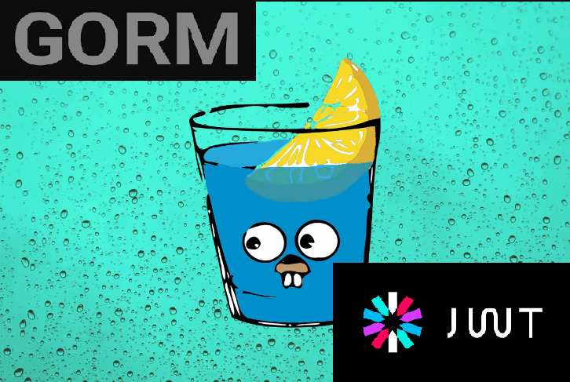

<h1 align="center">
  
</h1>

<h1 align="center">JWT and Gin</h1>
<p align = "center"> An API to manage registration, login and authentication</p>


<p align="center">
  <a href="#-technology">Technology</a>&nbsp;&nbsp;&nbsp;|&nbsp;&nbsp;&nbsp;
    <a href="#-project">Project</a>&nbsp;&nbsp;&nbsp;|&nbsp;&nbsp;&nbsp;
  <a href="#-how-to-run">How to Run</a>&nbsp;&nbsp;&nbsp;|&nbsp;&nbsp;&nbsp;
  <a href="#-license">License</a>
</p>

<p align="center">
  
</p>

## Introduction
This repository is an tutorial of how we can use JSON Web Token (JWT) and the Gin framework and in this way we can authenticate registered users. But what is a JWT?

The JSON Web Token is an internet open standard ([**RFC 7519**](https://tools.ietf.org/html/rfc7519)) for creating optionally signed and/or encrypted data whose payload contains the JSON that asserts some claim numbers. Tokens are signed using a private secret or a public/private key. JWTs can be signed using a secret (with the **HMAC** algorithm) or a public/private key pair using **RSA**, or **ECDSA**.

While JWTs can be encrypted to also provide secrecy between parties, we will focus on *signed tokens*. Signed tokens can verify the integrity of the claims contained within it, while encrypted tokens hide those claims from other parties. When tokens are signed using public/private key pairs, the signature also certifies that only the party that owns the private key is the one who signed it.
## ✨ Technology

The Project was develop as using the following techs:
- [Go](https://go.dev/)
- [Gorm](https://github.com/go-gorm/gorm)
- [MySQL](https://www.mysql.com/)
- [Gin](https://github.com/gin-gonic/gin)
- [JWT](https://github.com/golang-jwt/jwt)
- [crypto](https://pkg.go.dev/crypto)
- [godotenv](https://github.com/joho/godotenv)


## 💻 Project
As said before, this project is a simple one that only aims to demonstrate how users will be authenticated within our API. So it's a very simple project with endpoints. So for this project, we will need to create 2 public endpoints that will be used as authentication and 1 protected endpoint that will be protected by our JWT. So the in few lines we had 


###  📓 Requirements 
As educational project, and the purpose is use the concepts of CRUD, then we requirements of the our applications is to : 

1. Register a User
2. Login 
3. Authentication

As can be seen above the list of requirements is , in summary, a simple CRUD.

### Products Attributes

| User      | Type     |
| --------- | -------- |
| ID        | int      |
| Username  | string   |
| Password  | string   |
| CreatedAt | datetime |
| DeletedAt | datetime |
| UpdateAt  | datetime |


### End Points
The API has the following end points:

| Type       | url               | Functionality                                |
| ---------- | ----------------- | -------------------------------------------- |
| ```get```  | "/api/admin/user" | Authenticate the user to see the information |
| ```post``` | "/api/register"   | Register a User                              |
| ```post``` | "/api/login"      | Login                                        |


## 🚀 How to Run

To run the this project 

- Clone the repo and access the directory;
- You also need to have a MySQL and create a database and table;
  - The initial configurations can be encounter in `.env`, it is needed to use configure this instance;
- Init the instance in [`localhost: 8000`](http://localhost:8000) with `go run main.go`;
- If you have docker, you can use the following command:
```bash 
docker compose --env-file .env  up -d --build
```


## 📄 License
The projects is under the MIT license. See the file [LICENSE](LICENSE) fore more details

---
## Author

Made with ♥ by Rafael 👋🏻


[](https://www.linkedin.com/in/rafael-mgr/)
[](mailto:ribeirorafaelmatehus@gmail.com)
